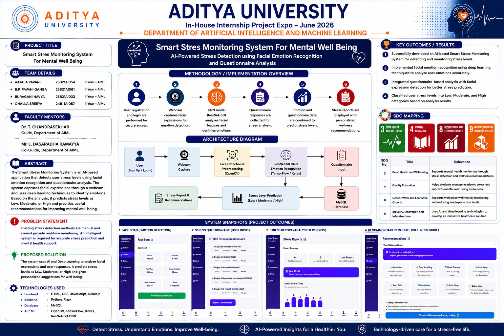
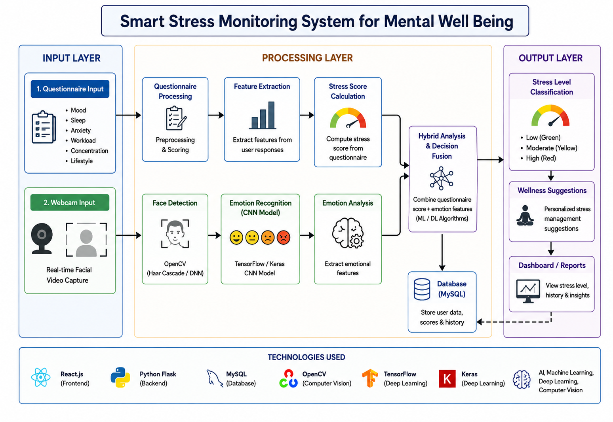
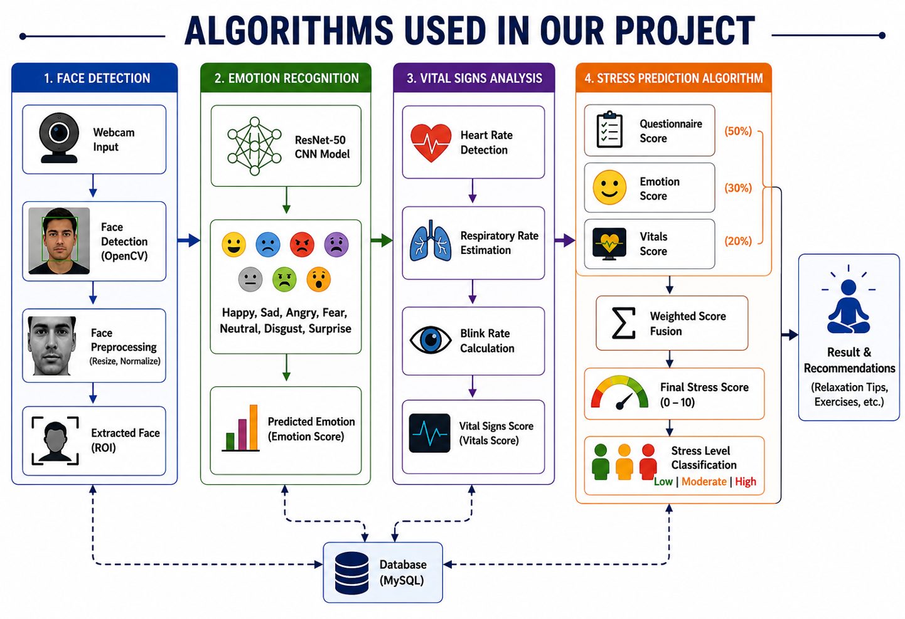
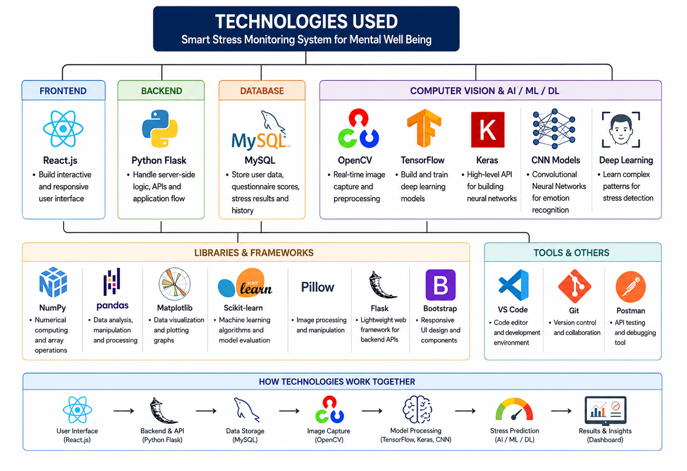
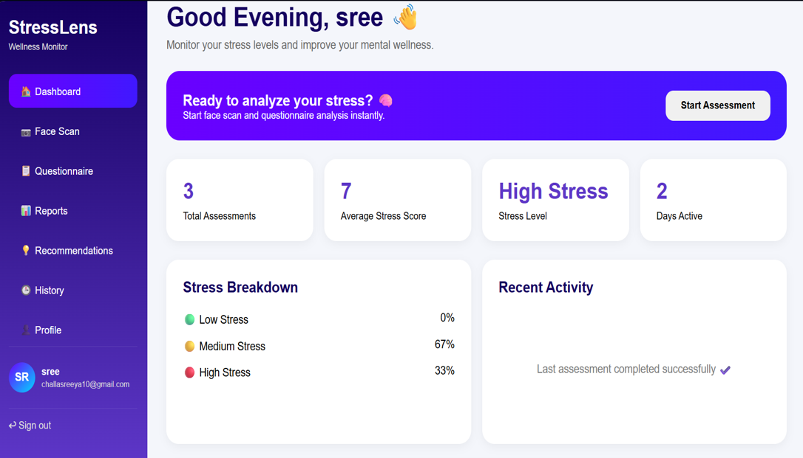
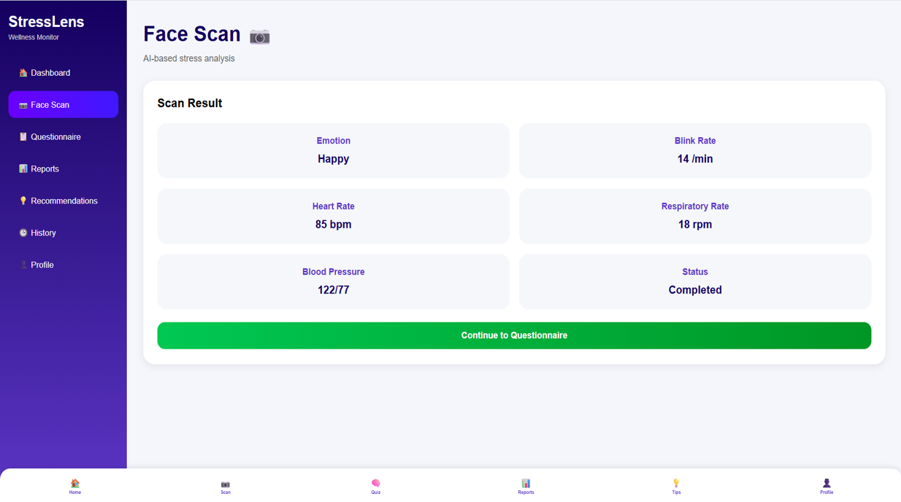
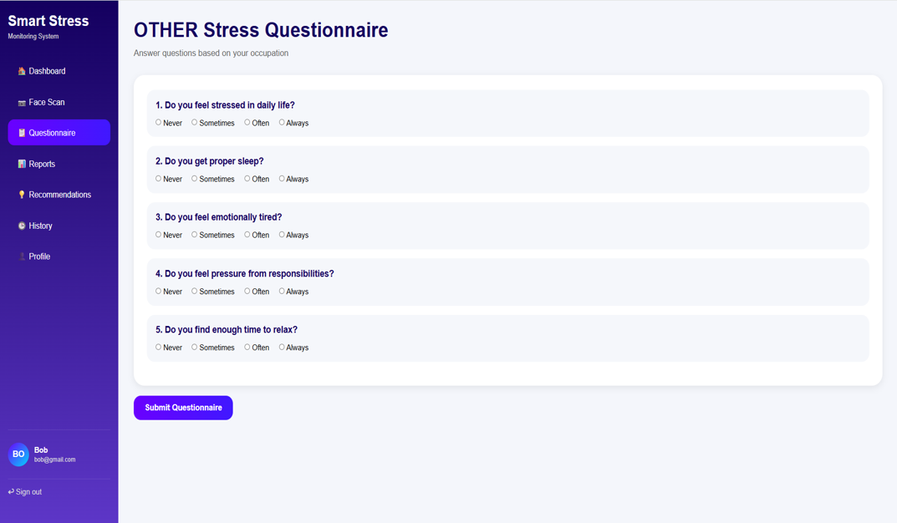
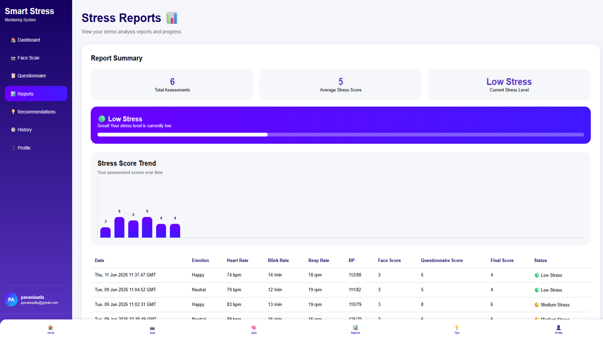

# 🧠 Smart Stress Monitoring System

> **AI-powered Stress Detection using Facial Emotion Recognition, Vital Signs Estimation, and Questionnaire Analysis for Mental Well-being.**




---

# 📖 Project Overview

The **Smart Stress Monitoring System** is an AI-powered web application developed to monitor and predict stress levels by combining **facial emotion recognition**, **estimated vital signs**, and **questionnaire analysis**.

The system captures facial expressions through a webcam, estimates physiological indicators such as **heart rate**, **blink rate**, **respiratory rate**, and **blood pressure**, combines these with questionnaire responses, and predicts the user's stress level as:

- 🟢 Low Stress
- 🟡 Moderate Stress
- 🔴 High Stress

Based on the prediction, the application provides personalized wellness recommendations to help improve mental well-being.

This project was developed as part of the **AI & ML In-House Internship Project (2026)** at **Aditya University**.

---

# ✨ Features

- 🔐 Secure User Registration & Login
- 😀 Facial Emotion Recognition
- ❤️ Vital Signs Estimation
- 📝 Dynamic Stress Questionnaire
- 🧠 AI-Based Stress Prediction
- 📊 Dashboard & Analytics
- 📈 Stress Reports & History
- 💡 Personalized Wellness Recommendations
- 👤 User Profile Management

---

# 🏗️ System Architecture



---

# 🧠 Algorithms Used



---

# 🛠️ Technologies Used



## Frontend

- HTML5
- CSS3
- JavaScript

## Backend

- Python
- Flask

## AI / Machine Learning

- TensorFlow
- Keras
- OpenCV
- ResNet-50 CNN

## Database

- MySQL

## Android Application

- Firebase Authentication
- TensorFlow Lite

---

# 📸 Application Screenshots

## 🔐 Login Page


---

## 📊 Dashboard



---

## 📷 Face Scan



---

## 📝 Questionnaire



---

## 📈 Reports



---

## 💡 Recommendations


---

# 📂 Project Structure

```text
smart-stress-monitoring-system
│
├── app.py
├── requirements.txt
├── smart_stress_database.sql
├── convert_tflite.py
│
├── static/
├── templates/
├── screenshots/
├── Reports/
├── PPT's/
└── models/
```

---

# 🤖 AI Models

The project was trained using the following deep learning model:

### Main Model

- **ResNet50 Emotion Recognition Model (.keras)**

### Android Models

- emotion_model.tflite
- emotion_model_quant.tflite

The TensorFlow Lite models were generated from the trained Keras model to support the Android application.

> **Note:**  
> Due to GitHub's file size limitations, the trained model files are not included in this repository.

---

# 📱 Android Companion Application

In addition to the web application, an Android version of the project was also developed to improve accessibility and usability.

The Android application includes:

- Firebase Authentication
- TensorFlow Lite Emotion Recognition
- Same AI prediction workflow as the web application

This Android application was developed as an **additional implementation** and is not the primary internship deliverable.

---

# 📄 Documentation

📑 Project Report

```
Reports/
```

🎤 Project Presentation

```
PPT's/
```

---

# 👥 Team

- **Biruda Purnima Pavani Ganga**
- Aatala Pavani
- Buragani Navya
- Challa Sreeya

**Repository Maintainer:**  
**Biruda Purnima Pavani Ganga**

### 👨‍🏫 Guide

- Dr. T. Chandrasekhar

### 👨‍🏫 Co-Guide

- Mr. L. Dasaradha Ramayya

---

# 🚀 Future Improvements

- ☁️ Cloud Deployment
- 📱 Full Android Application Release
- 🔔 Real-time Notifications
- 🩺 Doctor Consultation Module
- ⌚ Wearable Device Integration
- 📊 Advanced AI Analytics

---

# ⭐ Support

If you found this project useful, please consider giving it a ⭐ on GitHub.

---

## 📧 Contact

**Biruda Purnima Pavani Ganga**

AI & ML Undergraduate  
Aditya University

GitHub:
https://github.com/pavanibiruda
